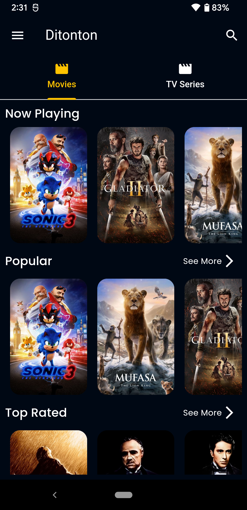
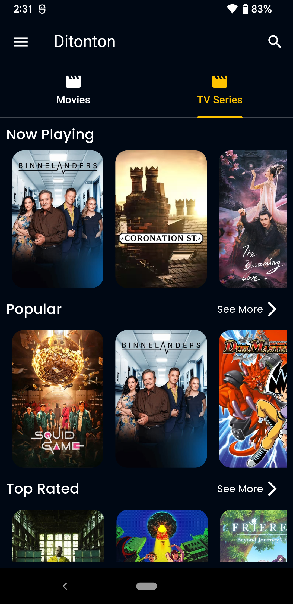
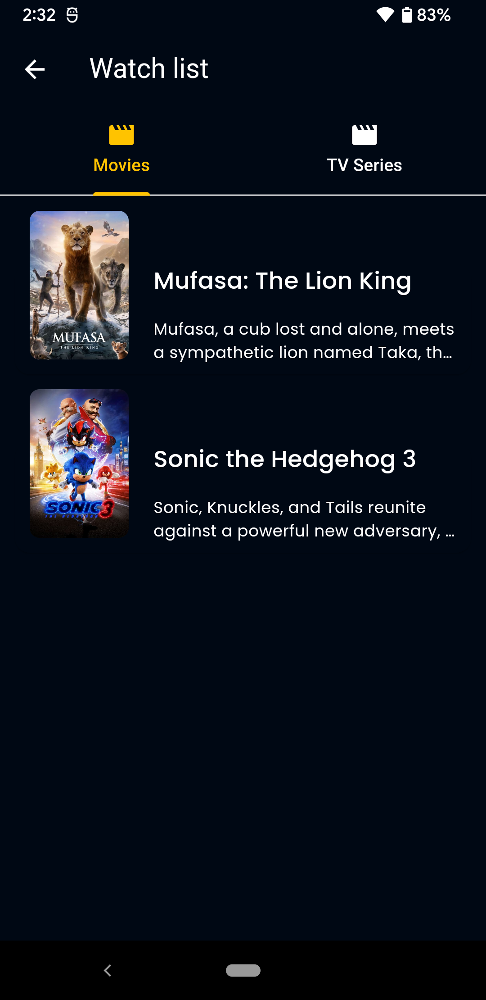
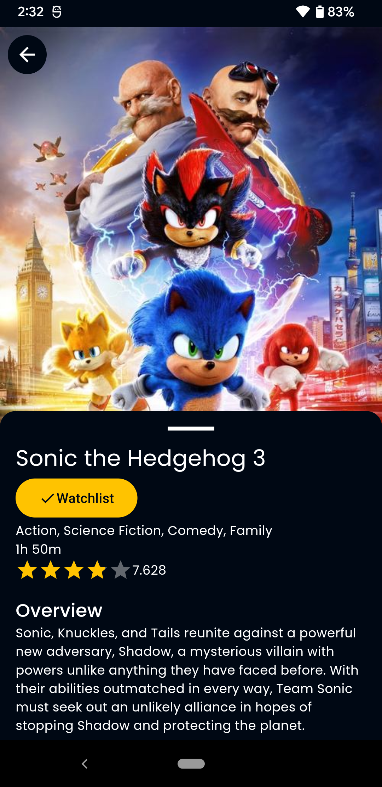

# Ditonton

  
  
  
  

## Overview

Awesome App is a Flutter-based mobile application that fetches and displays movie and tv-show from tmdb api, this project is from Dicoding "Menjadi Flutter Developer Expert".
